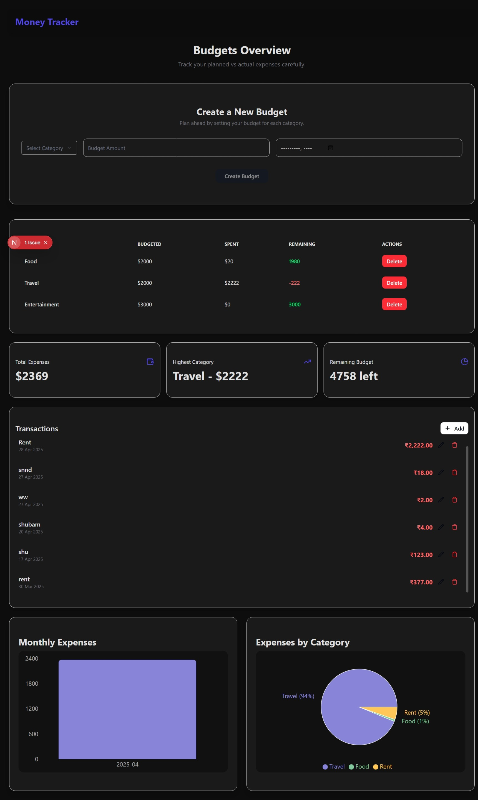
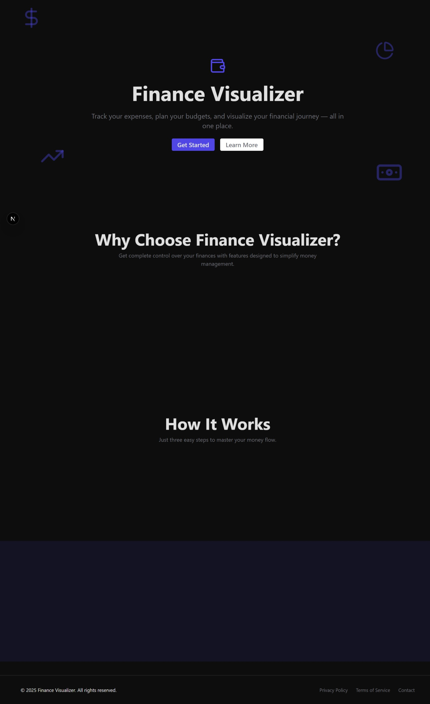

# Money Tracker

This app allows you to track your budgets, expenses, and categorize them for better financial planning.

## Features

- Create and manage monthly budgets.
- Track expenses by category.
- View visual insights with bar and pie charts.

## Screenshots

### Dashboard


### Homes


## Tech Stack

- **Frontend**: React, Vite, Tailwind CSS
- **Framework**: Next.js
- **State Management**: React Context API
- **Data Visualization**: Recharts
- **Database**: MongoDB
- **Icons**: Lucide Icons

## Installation

1. Clone the repository:

   ```bash
   git clone https://github.com/GuptaShubham-11/MoneyTracker.git
   ```

2. Install dependencies:

   ```bash
   cd MoneyTracker
   npm install
   ```

3. Run the development server:

   ```bash
   npm run dev
   ```

4. Open the app at `http://localhost:3000`.

## Usage

- **Budgets Overview**: Track planned vs actual expenses.
- **Charts Section**: Visualize your expenses with bar and pie charts.
- **Transaction Section**: Add, edit, and delete transactions.